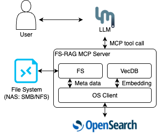

# FS-RAG

以檔案系統為資料來源、OpenSearch 為 vector store 的 RAG 系統

- 指定資料來源目錄
- 持續監控該目錄，並將檔案內容存入 vector store
  - 檔案發生變動 => 讀取檔案 => 切 chunk => 轉 embedding => vector store
- 提供 MCP tool 使 LLM 可以透過 MCP 查詢 vector store

## 動機

### 為何使用檔案系統

- 大部分 user 的資料以檔案格式統一儲存在 local 的目錄
- 或是某組織、部門會使用共享的檔案系統(SMB, NFS, ...)共享檔案
- 傳統 RAG 需要手動上傳這些檔案，並存在額外的 object store (S3, MinIO)
- 若能直接讀取檔案系統，對 user 來說使用體驗可能更好

### 爲何使用 OpenSearch

- OpenSearch 為 AWS 維護，開源版本的 ElasticSearch
- ES/OS 原先目的為企業搜尋引擎
  - No-SQL、structured 的資料格式
  - 巨量資料下，高速的關鍵字、條件查詢
  - 可有多節點：高可用、高可靠性
  - 後來常和 Fluentd/Logstash 搭配，用於 logging
- 近年兩者皆引入向量搜尋功能
  - 以及 ML、embedding 等功能
  - 可結合向量搜尋和傳統的關鍵字搜尋

## 架構



- server: 一個 Streamable HTTP MCP server
  - 提供 tool 對 vector store 搜尋
  - 維持系統的主要流程
- fs:
  - 監控目錄變化、讀取檔案內容
  - 會將每個檔案的變更時間存在 OpenSearch 中
- vecdb:
  - 將內容切成 chunk 並轉為 embedding
  - 寫入/讀取 OpenSearch 的 vector store

## 流程

### 監控檔案系統

1. 每隔 15 秒檢查目錄中，所有檔案的修改時間
2. 若拿到的修改時間和紀錄中的不同，或是有新的檔案
   - 將修改紀錄存入 dict 和 OpenSearch
3. 如果是新的檔案：讀取其內容並存入 OpenSearch
4. 如果檔案發生修改：從 OpenSearch 刪除原本的資料(Vector store 和 meta data)
5. 將檔案內容切成數個 chunk，轉換成 embedding 後存入 OpenSearch

### 查詢

1. MCP server 提供查詢 vector store 的 MCP tool
2. 輸入一字串，將該字串 embedding 後查詢 OpenSearch

## 運行

- 修改 docker-compose-example.yml 中，embedding model 的 API URL 和 key
- 用 docker compose 啟動 OpenSearch 和 RAG

```
docker compose up -d
```

## TODO

- 系統沒有考慮檔案刪除時的處理
- 在 Windows, MacOS 等平台做測試
- 接入 NAS, NFS 等網路檔案系統做測試
- 對於大量檔案時，可能需要更穩健的 retry/error handling
  - redis
  - message queue
- RAG 本身的細節還需要再調整：
  - OCR, Parser
  - Chunk & Embedding
- OpenSearch 本身提供更進階的 vector search 功能
- 更便捷的部署方式
